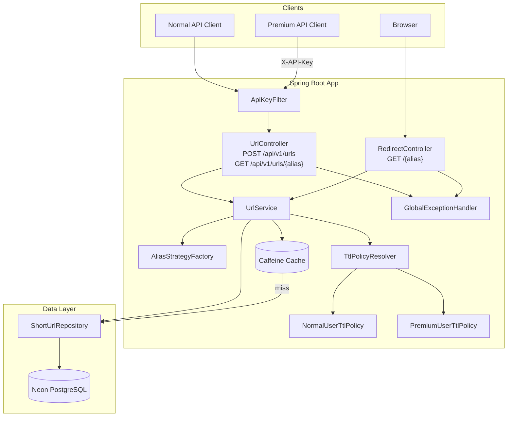
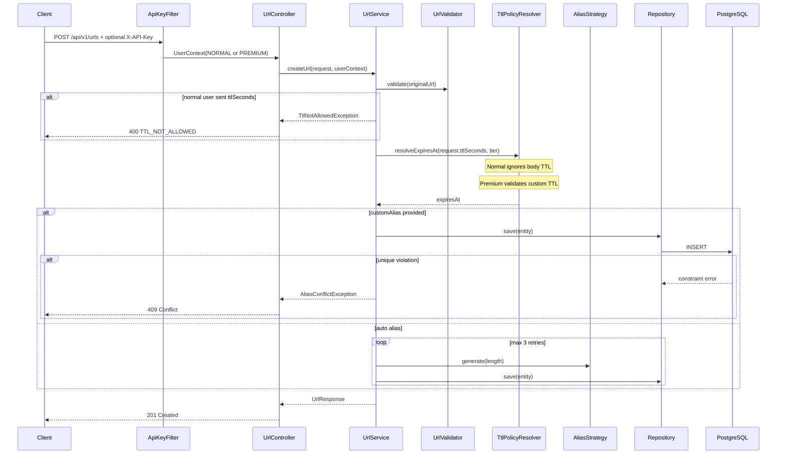
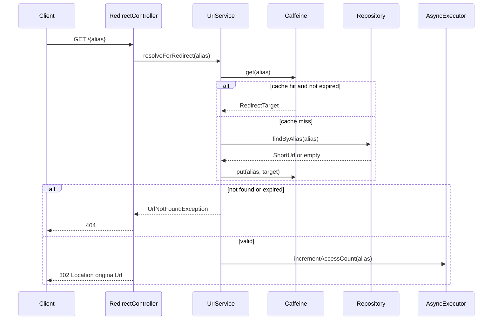

# URL Shortener — Master Build Plan

> **Status:** Updated — awaiting your approval before implementation.
>
> **Stack:** Java 21 · Spring Boot 4.1 · Maven · Flyway · Neon PostgreSQL · Caffeine · Springdoc · JUnit 5 · Mockito · Testcontainers · GitHub Actions · DigitalOcean App Platform
>
> **Approach:** TDD (test first, then implement). One step at a time. All tests pass before moving on.

---

## Table of contents

1. [Goal & requirements mapping](#1-goal--requirements-mapping)
2. [Decisions locked in](#2-decisions-locked-in)
3. [Design patterns (what we use and why)](#3-design-patterns-what-we-use-and-why)
4. [Architecture](#4-architecture)
5. [Package structure](#5-package-structure)
6. [API contract](#6-api-contract)
7. [Database schema](#7-database-schema)
8. [Concurrency & N+1 strategy](#8-concurrency--n1-strategy)
9. [Caching strategy](#9-caching-strategy)
10. [Alias generation — Strategy pattern](#10-alias-generation--strategy-pattern)
11. [TTL policy — Tier-based Strategy pattern](#11-ttl-policy--tier-based-strategy-pattern)
12. [Edge cases catalog](#12-edge-cases-catalog)
13. [Error handling & HTTP status codes](#13-error-handling--http-status-codes)
14. [Configuration & environment variables](#14-configuration--environment-variables)
15. [Code quality standards](#15-code-quality-standards)
16. [Testing strategy (TDD)](#16-testing-strategy-tdd)
17. [Implementation steps (1–11)](#17-implementation-steps-111)
18. [CI/CD pipeline](#18-cicd-pipeline)
19. [DigitalOcean deployment](#19-digitalocean-deployment)
20. [Definition of done](#20-definition-of-done)
21. [Out of scope (avoid over-engineering)](#21-out-of-scope-avoid-over-engineering)
22. [Open questions (confirm if you disagree)](#22-open-questions-confirm-if-you-disagree)

---

## 1. Goal & requirements mapping

Build a **production-ready REST API** that:

| Requirement | How we satisfy it |
|-------------|-------------------|
| Accept a long URL and generate a shortened URL | `POST /api/v1/urls` |
| Support custom aliases | Optional `customAlias` field (all tiers) |
| Handle alias collisions / race conditions | DB `UNIQUE` constraint + catch `DataIntegrityViolationException` → 409 |
| Redirect users to original URL | `GET /{alias}` → **302 Found** |
| Cache heavily accessed links | Caffeine cache-aside on redirect path |
| Return metadata (createdAt, accessCount) | `GET /api/v1/urls/{alias}` |
| Architecture flow diagram | Mermaid diagram in README |
| Validation, error handling, thread-safe updates | `@Valid`, `@RestControllerAdvice`, atomic SQL updates |
| Unit + integration tests | JUnit 5, Mockito, `@SpringBootTest`, Testcontainers |
| CI/CD pipeline | GitHub Actions — tests must pass before deploy |
| README with setup/run/test | Step 9 |
| Deploy to DigitalOcean | Step 11 |
| **TTL expiration — tier-based** | **Normal user:** TTL from `application.yml` only. **Premium user:** custom `ttlSeconds` via API key. Expired → **404** |

---

## 2. Decisions locked in

| Topic | Decision |
|-------|----------|
| Java version | **21** (keep current `pom.xml`) |
| Redirect HTTP status | **302 Found** |
| Expired link response | **404 Not Found** (same as missing alias) |
| User tiers | **Normal** (default) and **Premium** (API key) |
| Tier identification | `X-API-Key` header — no user accounts / signup |
| Invalid / missing API key | **Fail open → Normal tier** (public demo friendly) |
| Normal user TTL | Always `app.ttl.default-seconds` from YAML — **cannot** set `ttlSeconds` in body |
| Normal user sends `ttlSeconds` | **400** `TTL_NOT_ALLOWED` |
| Premium user TTL | Optional `ttlSeconds` in body; validated against `app.ttl.premium-max-seconds` |
| Premium user omits `ttlSeconds` | Uses YAML `default-seconds` (same as normal default) |
| Custom alias | **All tiers** — not premium-only |
| Default alias strategy | **Configurable** via `application.yml`; default = **Base62** |
| Database | **Neon PostgreSQL** (Postgres-compatible) |
| Package rename | `com.fetaure.flag.demo` → **`com.urlshortener`** |
| Artifact rename | `demo` → **`url-shortener`** |

---

## 3. Design patterns (what we use and why)

We apply patterns **only where they reduce complexity or enable future change** — not for resume padding.

### 3.1 Strategy — Alias generation

**Problem:** Auto-generated aliases can use different encoding schemes (Base62 today, Base64 URL-safe or others tomorrow). Swap algorithms without touching `UrlService`.

```
AliasGenerationStrategy (interface)
├── generate(length: int): String
└── getStrategyName(): String

Implementations:
├── Base62AliasStrategy        # default — [a-zA-Z0-9]
├── Base64UrlAliasStrategy      # [A-Za-z0-9-_]
└── (future) HashBasedStrategy

AliasStrategyFactory
└── resolves from config: app.alias.strategy=base62
```

**Spring wiring:** Each strategy is a `@Component`. `AliasStrategyConfig` reads config and exposes active strategy.

---

### 3.2 Strategy — TTL policy (tier-based)

**Problem:** Normal and premium users have different TTL rules. Encapsulate each rule set; keep `UrlService` free of tier `if/else` chains.

```
TtlPolicy (interface)
└── resolveExpiresAt(Optional<Integer> requestedTtl, Instant createdAt): Instant

Implementations:
├── NormalUserTtlPolicy     # ignores requestedTtl; always default-seconds
└── PremiumUserTtlPolicy    # uses requestedTtl if present; validates max

TtlPolicyResolver
└── selects policy from UserContext.tier()
```

See [Section 11](#11-ttl-policy--tier-based-strategy-pattern) for full detail.

---

### 3.3 Repository — Data access

Spring Data JPA `ShortUrlRepository`. Keeps SQL/JPQL out of the service layer.

---

### 3.4 DTO / Record — API boundary

Java records for request/response. No JPA entity leaked to HTTP layer.

---

### 3.5 Cache-Aside — Redirect hot path

Check Caffeine → on miss query DB → populate cache. DB is source of truth.

---

### 3.6 Filter — Tier identification (lightweight)

`ApiKeyAuthenticationFilter` resolves `UserContext(UserTier tier)` from `X-API-Key`. Not full OAuth — tier identification only.

---

### 3.7 Global exception handling — `@RestControllerAdvice`

Centralized exception → HTTP status + JSON error body.

---

### 3.8 Patterns explicitly avoided

| Pattern | Why skipped |
|---------|-------------|
| CQRS / Event Sourcing | Overkill for CRUD API |
| Saga / Outbox | No distributed transactions |
| Redis | Caffeine sufficient at this scale |
| Full user auth / JWT / OAuth | API key tier is enough for v1 |
| Generic plugin framework | YAGNI |
| Factory hierarchy for every class | Only alias + TTL strategies warrant it |

---

## 4. Architecture



### Request lifecycle — Create URL (with tier + TTL)



### Request lifecycle — Redirect



---

## 5. Package structure

```
src/main/java/com/urlshortener/
├── UrlShortenerApplication.java
├── config/
│   ├── CacheConfig.java
│   ├── AsyncConfig.java
│   ├── OpenApiConfig.java
│   ├── AliasStrategyConfig.java
│   ├── TtlProperties.java              # @ConfigurationProperties
│   └── SecurityProperties.java         # premium API keys
├── security/
│   ├── UserTier.java                     # enum: NORMAL, PREMIUM
│   ├── UserContext.java                  # record
│   └── ApiKeyAuthenticationFilter.java
├── controller/
│   ├── UrlController.java
│   └── RedirectController.java
├── service/
│   ├── UrlService.java
│   ├── alias/
│   │   ├── AliasGenerationStrategy.java
│   │   ├── Base62AliasStrategy.java
│   │   ├── Base64UrlAliasStrategy.java
│   │   └── AliasStrategyFactory.java
│   └── ttl/
│       ├── TtlPolicy.java
│       ├── NormalUserTtlPolicy.java
│       ├── PremiumUserTtlPolicy.java
│       └── TtlPolicyResolver.java
├── repository/
│   └── ShortUrlRepository.java
├── domain/
│   └── ShortUrl.java
├── dto/
│   ├── CreateUrlRequest.java
│   ├── UrlResponse.java
│   └── ErrorResponse.java
├── exception/
│   ├── AliasConflictException.java
│   ├── UrlNotFoundException.java
│   ├── InvalidUrlException.java
│   ├── InvalidAliasException.java
│   ├── TtlNotAllowedException.java
│   ├── InvalidTtlException.java
│   └── GlobalExceptionHandler.java
└── util/
    └── UrlValidator.java

src/main/resources/
├── application.yml
├── application-local.yml
├── application-test.yml
└── db/migration/
    └── V1__create_short_urls.sql

src/test/java/com/urlshortener/
├── service/
│   ├── UrlServiceTest.java
│   ├── alias/
│   │   ├── Base62AliasStrategyTest.java
│   │   └── Base64UrlAliasStrategyTest.java
│   └── ttl/
│       ├── NormalUserTtlPolicyTest.java
│       ├── PremiumUserTtlPolicyTest.java
│       └── TtlPolicyResolverTest.java
├── security/
│   └── ApiKeyAuthenticationFilterTest.java
├── controller/
│   ├── UrlControllerTest.java
│   └── RedirectControllerTest.java
├── repository/
│   └── ShortUrlRepositoryTest.java
└── integration/
    ├── RedirectIntegrationTest.java
    ├── AliasConcurrencyIntegrationTest.java
    ├── TierTtlIntegrationTest.java
    └── UrlLifecycleIntegrationTest.java
```

---

## 6. API contract

### 6.1 User tiers

| Tier | Identification | TTL behavior |
|------|----------------|--------------|
| **Normal** | No header, or invalid/unknown key → treated as normal | `expiresAt = now + app.ttl.default-seconds`. **`ttlSeconds` in body → 400** |
| **Premium** | Valid `X-API-Key: <premium-key>` | Optional `ttlSeconds` in body. If omitted → YAML default. Max = `premium-max-seconds` |

### 6.2 Create short URL — Normal user

```
POST /api/v1/urls
Content-Type: application/json
```

```json
{
  "originalUrl": "https://example.com/some/long/path?q=1",
  "customAlias": "my-link"
}
```

| Field | Required | Rules |
|-------|----------|-------|
| `originalUrl` | Yes | Valid HTTP/HTTPS URL, max 2048 chars |
| `customAlias` | No | 3–64 chars, `[a-zA-Z0-9_-]`, not reserved |
| `ttlSeconds` | **Not allowed** | If present → **400 `TTL_NOT_ALLOWED`** |

**Response 201:** `expiresAt` always set from YAML default (never null for normal users).

---

### 6.3 Create short URL — Premium user

```
POST /api/v1/urls
Content-Type: application/json
X-API-Key: <premium-key>
```

```json
{
  "originalUrl": "https://example.com/some/long/path?q=1",
  "customAlias": "my-link",
  "ttlSeconds": 3600
}
```

| Field | Required | Rules |
|-------|----------|-------|
| `originalUrl` | Yes | Same as normal |
| `customAlias` | No | Same as normal |
| `ttlSeconds` | No | If present: positive integer, max `premium-max-seconds`. If omitted: YAML default |

**Response 201:**

```json
{
  "shortUrl": "https://your-app.ondigitalocean.app/my-link",
  "alias": "my-link",
  "originalUrl": "https://example.com/some/long/path?q=1",
  "createdAt": "2026-06-28T12:00:00Z",
  "accessCount": 0,
  "expiresAt": "2026-06-28T13:00:00Z"
}
```

---

### 6.4 Get metadata

```
GET /api/v1/urls/{alias}
```

**Response 200:** Same shape as create response.

**Response 404:** Alias not found or expired.

---

### 6.5 Redirect

```
GET /{alias}
```

**Response 302:** `Location: {originalUrl}`

**Response 404:** Alias not found or expired.

**Note:** Paths `/api/**`, `/swagger-ui/**`, `/actuator/**` excluded from redirect controller.

---

## 7. Database schema

**Flyway V1:** `V1__create_short_urls.sql`

```sql
CREATE TABLE short_urls (
    id           BIGSERIAL PRIMARY KEY,
    alias        VARCHAR(64)  NOT NULL,
    original_url TEXT         NOT NULL,
    access_count BIGINT       NOT NULL DEFAULT 0,
    created_at   TIMESTAMPTZ  NOT NULL DEFAULT NOW(),
    expires_at   TIMESTAMPTZ  NOT NULL,
    CONSTRAINT uq_short_urls_alias UNIQUE (alias)
);

CREATE INDEX idx_short_urls_expires_at ON short_urls (expires_at);
```

**Note:** `expires_at` is **NOT NULL** — every link expires. Normal users get YAML default; premium users get custom or default. No "never expire" in v1.

**JPA settings:**
- `spring.jpa.hibernate.ddl-auto=validate`
- `spring.flyway.enabled=true`
- `spring.jpa.open-in-view=false`

**No tier column in DB** — tier affects TTL only at creation time; stored result is `expires_at`.

---

## 8. Concurrency & N+1 strategy

### Concurrency

| Scenario | Mechanism |
|----------|-----------|
| Two users request same **custom alias** simultaneously | PostgreSQL `UNIQUE(alias)` → one 201, one **409** |
| Two auto-generated aliases collide | Retry insert up to **3 times** |
| Concurrent redirects incrementing count | Atomic `@Modifying` UPDATE |
| Concurrent cache population | Caffeine handles; worst case duplicate DB read |

### N+1 prevention

| Operation | Queries | Notes |
|-----------|---------|-------|
| Redirect | 0 (cache hit) or **1** `findByAlias` | No lazy collections |
| Metadata | **1** `findByAlias` | No joins |
| Create | **1** INSERT | Rely on DB constraint, not pre-check |
| Increment count | **1** UPDATE | Async, no entity load |

**Rule:** `ShortUrl` entity has **no `@OneToMany` / `@ManyToOne`**.

---

## 9. Caching strategy

| Setting | Value |
|---------|-------|
| Implementation | Caffeine via `spring-boot-starter-cache` |
| Cache name | `redirectCache` |
| Key | `alias` (String) |
| Value | `RedirectTarget(originalUrl, expiresAt)` record |
| Max size | 10,000 entries (configurable) |
| TTL | 10 minutes expire-after-write (configurable) |
| Eviction on expiry | On read: if `expiresAt < now` → 404, evict key |

**Cache is an optimization, not source of truth.**

---

## 10. Alias generation — Strategy pattern

### Interface

```java
public interface AliasGenerationStrategy {
    String generate(int length);
    String getStrategyName();
}
```

### Implementations

| Strategy | Alphabet | Config key |
|----------|----------|------------|
| `Base62AliasStrategy` | `a-zA-Z0-9` (62 chars) | `base62` **(default)** |
| `Base64UrlAliasStrategy` | `A-Za-z0-9-_` (64 chars) | `base64url` |

### Configuration

```yaml
app:
  alias:
    strategy: base62
    auto-length: 7
```

### Custom alias (not strategy-based)

When `customAlias` is provided, strategy is **not** used:

- Length: 3–64
- Pattern: `^[a-zA-Z0-9_-]+$`
- Reserved: `api`, `health`, `actuator`, `swagger`, `swagger-ui`, `v1`, `v3`, `docs`

### Adding a future strategy

1. Implement `AliasGenerationStrategy`
2. Register as `@Component`
3. Add to factory map
4. Set `app.alias.strategy=<name>`
5. Unit tests for alphabet + length

No changes to `UrlService` or controllers.

---

## 11. TTL policy — Tier-based Strategy pattern

### Interface

```java
public interface TtlPolicy {
    Instant resolveExpiresAt(Optional<Integer> requestedTtlSeconds, Instant createdAt);
}
```

### NormalUserTtlPolicy

```java
// Always ignores requestedTtlSeconds
// returns createdAt + app.ttl.default-seconds
```

Called only after controller/service confirms normal user did **not** send `ttlSeconds`. If they did → `TtlNotAllowedException` before policy is invoked.

### PremiumUserTtlPolicy

```java
// If requestedTtlSeconds present → validate (0 < ttl <= premium-max-seconds)
// If absent → createdAt + app.ttl.default-seconds
// Invalid → InvalidTtlException → 400
```

### TtlPolicyResolver

```java
public TtlPolicy resolve(UserTier tier) {
    return tier == PREMIUM ? premiumPolicy : normalPolicy;
}
```

### Configuration

```yaml
app:
  ttl:
    default-seconds: 86400           # 24 hours — used by BOTH tiers when no custom TTL
    premium-max-seconds: 31536000    # 1 year — max premium can request
  security:
    premium-api-keys:
      - ${PREMIUM_API_KEY:local-dev-premium-key}
```

### Usage in UrlService

```java
public UrlResponse createUrl(CreateUrlRequest request, UserContext userContext) {
    if (userContext.tier() == NORMAL && request.ttlSeconds().isPresent()) {
        throw new TtlNotAllowedException();
    }
    TtlPolicy policy = ttlPolicyResolver.resolve(userContext.tier());
    Instant expiresAt = policy.resolveExpiresAt(request.ttlSeconds(), clock.instant());
    // ... save entity with expiresAt
}
```

### Adding a future tier (e.g. Enterprise)

1. Add `UserTier.ENTERPRISE`
2. Implement `EnterpriseTtlPolicy`
3. Register in resolver
4. Unit tests — no `UrlService` changes beyond resolver injection

---

## 12. Edge cases catalog

Every edge case must have a test before or during the step that handles it.

### 12.1 Create URL — `originalUrl`

| # | Edge case | Expected behavior |
|---|-----------|-------------------|
| E1 | Missing `originalUrl` | 400 |
| E2 | Empty string | 400 |
| E3 | Not a valid URL | 400 |
| E4 | URL without scheme | 400 — require `http://` or `https://` |
| E5 | Non-http(s) scheme (`ftp://`) | 400 |
| E6 | URL longer than 2048 chars | 400 |
| E7 | URL with unicode / IDN | Accept if `java.net.URI` validates |
| E8 | URL with query params and fragments | Accept and store as-is |
| E9 | Duplicate long URL | **Allow** — multiple aliases per URL |
| E10 | `javascript:alert(1)` | 400 — block dangerous schemes |

### 12.2 Create URL — `customAlias`

| # | Edge case | Expected behavior |
|---|-----------|-------------------|
| E11 | Valid custom alias | 201 |
| E12 | Alias already exists | 409 |
| E13 | Two concurrent requests for same alias | One 201, one 409 |
| E14 | Alias too short (1–2 chars) | 400 |
| E15 | Alias too long (>64 chars) | 400 |
| E16 | Special chars / spaces | 400 |
| E17 | Reserved word (`api`, `health`) | 400 |
| E18 | Case-only difference (`AbC` vs `abc`) | Both allowed (case-sensitive) |

### 12.3 Create URL — auto alias

| # | Edge case | Expected behavior |
|---|-----------|-------------------|
| E19 | No custom alias | 201 with generated alias |
| E20 | Generated alias collision (mocked) | Retry within 3 attempts |
| E21 | 3 consecutive collisions | 500 |
| E22 | Config `base64url` | Alias uses `-` and `_` |

### 12.4 Create URL — TTL & tiers

| # | Edge case | Expected behavior |
|---|-----------|-------------------|
| E23 | Normal user, no `ttlSeconds` | 201; `expiresAt = now + default-seconds` |
| E24 | Normal user sends `ttlSeconds` | **400 `TTL_NOT_ALLOWED`** |
| E25 | Premium, valid custom TTL (3600) | 201; `expiresAt = now + 3600` |
| E26 | Premium, no `ttlSeconds` | 201; `expiresAt = now + default-seconds` |
| E27 | Premium, TTL = 0 or negative | 400 `INVALID_TTL` |
| E28 | Premium, TTL > premium-max-seconds | 400 `INVALID_TTL` |
| E29 | Invalid API key | Treated as **normal** tier |
| E30 | Valid premium key | Premium tier TTL rules apply |
| E31 | Premium key env missing in prod | All users treated as normal |

### 12.5 Redirect — `GET /{alias}`

| # | Edge case | Expected behavior |
|---|-----------|-------------------|
| E32 | Valid alias | 302 + correct `Location` |
| E33 | Unknown alias | 404 |
| E34 | Expired alias | 404 |
| E35 | URL with special chars in Location | Properly encoded |
| E36 | Hot link (repeat requests) | Cache hit after first DB read |
| E37 | Request to `/api/v1/urls` | API controller, not redirect |

### 12.6 Metadata — `GET /api/v1/urls/{alias}`

| # | Edge case | Expected behavior |
|---|-----------|-------------------|
| E38 | Valid alias | 200 with createdAt, accessCount, expiresAt |
| E39 | Unknown alias | 404 |
| E40 | Expired alias | 404 |
| E41 | After redirects | accessCount eventually updated (async) |

### 12.7 Concurrency & data integrity

| # | Edge case | Expected behavior |
|---|-----------|-------------------|
| E42 | Simultaneous custom alias creation | DB constraint — one winner |
| E43 | Redirect during creation | 404 until committed |
| E44 | High concurrent redirects | Atomic increment, no lost counts |

### 12.8 Infrastructure & config

| # | Edge case | Expected behavior |
|---|-----------|-------------------|
| E45 | Missing `DATABASE_URL` in prod | Fail fast on startup |
| E46 | Invalid alias strategy in config | Fail fast on startup |
| E47 | `default-seconds <= 0` | Fail fast on startup |
| E48 | Flyway on empty DB | Tables created |
| E49 | Flyway on existing DB | Validates, no re-apply |

---

## 13. Error handling & HTTP status codes

**Standard error body:**

```json
{
  "error": "TTL_NOT_ALLOWED",
  "message": "Custom TTL is only available for premium users",
  "timestamp": "2026-06-28T12:00:00Z"
}
```

| Status | When | Error code |
|--------|------|------------|
| 201 | URL created | — |
| 200 | Metadata retrieved | — |
| 302 | Redirect | — |
| 400 | Validation, invalid URL/alias/TTL | `VALIDATION_ERROR`, `INVALID_URL`, `INVALID_ALIAS`, `INVALID_TTL`, **`TTL_NOT_ALLOWED`** |
| 404 | Not found or expired | `URL_NOT_FOUND` |
| 409 | Custom alias taken | `ALIAS_CONFLICT` |
| 500 | Unexpected error | `INTERNAL_ERROR` (no stack trace in body) |

---

## 14. Configuration & environment variables

### application.yml (shared)

```yaml
spring:
  application:
    name: url-shortener
  jpa:
    hibernate:
      ddl-auto: validate
    open-in-view: false
  flyway:
    enabled: true

app:
  base-url: http://localhost:8080
  alias:
    strategy: base62
    auto-length: 7
  ttl:
    default-seconds: 86400
    premium-max-seconds: 31536000
  security:
    premium-api-keys:
      - ${PREMIUM_API_KEY:local-dev-premium-key}
  cache:
    max-size: 10000
    expire-minutes: 10

springdoc:
  api-docs:
    path: /v3/api-docs
  swagger-ui:
    path: /swagger-ui.html
```

### Environment variables (prod / Neon)

| Variable | Required | Description |
|----------|----------|-------------|
| `DATABASE_URL` | Yes | Neon PostgreSQL JDBC URL |
| `BASE_URL` | Yes | Public app URL for `shortUrl` |
| `PREMIUM_API_KEY` | Yes (prod) | Premium tier API key |
| `SPRING_PROFILES_ACTIVE` | Yes | `prod` on DigitalOcean |
| `PORT` | Auto | Set by DO App Platform |
| `APP_ALIAS_STRATEGY` | No | Override alias strategy |

### Fail-fast validation at startup

- Unknown `app.alias.strategy` → startup failure
- `default-seconds <= 0` or `premium-max-seconds <= 0` → startup failure
- `premium-max-seconds < default-seconds` → startup failure

---

## 15. Code quality standards

### Layer responsibilities

| Class | Single responsibility |
|-------|----------------------|
| `UrlController` | HTTP mapping, `@Valid`, pass `UserContext` |
| `UrlService` | Orchestration only — no URL parsing, no TTL math |
| `TtlPolicy` / `AliasGenerationStrategy` | Business rules |
| `UrlValidator` | URL semantics |
| `ApiKeyAuthenticationFilter` | Tier resolution only |
| `GlobalExceptionHandler` | Error mapping only |

### Immutability

- Request/response = **records**
- `UserContext`, `RedirectTarget` = **records**
- JPA entity = mutable (acceptable)

### Time dependency

- Inject `Clock` — never `Instant.now()` directly in service/policy
- Fixed clock in tests for TTL expiry scenarios

### Configuration

- All magic numbers in `@ConfigurationProperties` (`TtlProperties`, `AliasProperties`)
- No hardcoded TTL values in Java code

### Validation layering (no duplication)

| Layer | Validates |
|-------|-----------|
| Bean Validation (`@Valid`) | Format, required fields |
| `UrlService` | Tier + TTL allowed check (`TTL_NOT_ALLOWED`) |
| `UrlValidator` | URL semantics, blocked schemes |
| `TtlPolicy` | Tier-specific TTL computation |
| DB | Alias uniqueness |

### Logging

| Level | When |
|-------|------|
| INFO | Link created (alias, tier, expiresAt) |
| WARN | Alias collision, invalid premium TTL attempt |
| ERROR | Auto alias retry exhaustion |

Never log full `originalUrl` if it may contain sensitive query params (log alias only).

### General rules

- `open-in-view: false`
- No `@Transactional` on controller
- `@Transactional` on service write methods only
- Prefer explicit exceptions over boolean return codes
- Every public service method has a unit test
- Every endpoint has at least one WebMvcTest

---

## 16. Testing strategy (TDD)

### Workflow per step

1. Write failing test(s)
2. Run `mvn test` — confirm failure
3. Implement minimum code to pass
4. Refactor
5. Run `mvn verify` — all green
6. **Stop. Wait for your approval before next step.**

### Test layers

| Layer | Tool | Purpose |
|-------|------|---------|
| Unit | JUnit 5 + Mockito | Service, policies, validators, strategies |
| Web slice | `@WebMvcTest` | Controller contracts, status codes |
| Data slice | `@DataJpaTest` | Repository, unique constraint |
| Integration | `@SpringBootTest` + Testcontainers | Full flows, concurrency, tiers |
| CI | GitHub Actions | `mvn verify` on every push/PR |

### Key test classes per step

| Step | Tests to write first |
|------|---------------------|
| 1 | `UrlShortenerApplicationTests` |
| 2 | `ShortUrlRepositoryTest` |
| 3 | `UrlValidatorTest`, `Base62AliasStrategyTest`, `UrlServiceTest`, `UrlControllerTest` |
| 4 | `AliasConcurrencyIntegrationTest` |
| 5 | `RedirectControllerTest`, `RedirectIntegrationTest` |
| 6 | Metadata tests in `UrlControllerTest` |
| 7a | `NormalUserTtlPolicyTest`, `PremiumUserTtlPolicyTest`, `TtlPolicyResolverTest` |
| 7b | `ApiKeyAuthenticationFilterTest` |
| 7c | `TierTtlIntegrationTest` — normal vs premium end-to-end |
| 8 | `GlobalExceptionHandlerTest`, async increment test |
| 9–11 | Smoke / CI verification |

---

## 17. Implementation steps (1–11)

### Step 1 — Foundation & project setup

**Goal:** Runnable app with deps, config profiles, package rename.

**Tasks:**
- [ ] Rename package `com.fetaure.flag.demo` → `com.urlshortener`
- [ ] Rename artifact `demo` → `url-shortener` in `pom.xml`
- [ ] Add dependencies: PostgreSQL, Flyway, Validation, Cache+Caffeine, Springdoc, Actuator, Testcontainers
- [ ] Create `application.yml`, `application-local.yml`, `application-test.yml`
- [ ] Configure Flyway + JPA validate + open-in-view false
- [ ] Add `TtlProperties`, `SecurityProperties` with startup validation
- [ ] Add `.env.example` (no secrets committed)

**Tests:** Context loads with test profile.

**Exit criteria:** `mvn verify` passes.

---

### Step 2 — Database schema, entity, repository

**Goal:** Persistence layer ready.

**Tasks:**
- [ ] Write `V1__create_short_urls.sql` (`expires_at NOT NULL`)
- [ ] Create `ShortUrl` entity
- [ ] Create `ShortUrlRepository`: `findByAlias`, `@Modifying incrementAccessCount`

**Tests (TDD):**
- [ ] Save and find by alias
- [ ] Duplicate alias throws on second insert
- [ ] Increment access count atomically

**Exit criteria:** `@DataJpaTest` green.

---

### Step 3 — Auto alias creation (Alias Strategy + create API)

**Goal:** `POST /api/v1/urls` works for normal user without custom alias.

**Tasks:**
- [ ] `AliasGenerationStrategy`, `Base62AliasStrategy`, `Base64UrlAliasStrategy`
- [ ] `AliasStrategyFactory` + `AliasStrategyConfig`
- [ ] `UrlValidator`
- [ ] `UrlService.createUrl()` — auto alias path (temporary: fixed TTL from YAML, tier wiring in Step 7)
- [ ] `UrlController` POST endpoint
- [ ] `CreateUrlRequest`, `UrlResponse` DTOs
- [ ] Stub `UserContext(NORMAL)` until Step 7b

**Tests (TDD):**
- [ ] Strategy charset + length tests
- [ ] Invalid URL → 400
- [ ] Valid URL → 201 with generated alias

**Exit criteria:** Unit + WebMvcTest green.

---

### Step 4 — Custom alias + collision handling

**Goal:** Optional custom alias with safe concurrency.

**Tasks:**
- [ ] Custom alias validation + reserved words
- [ ] `DataIntegrityViolationException` → `AliasConflictException` → 409
- [ ] Auto alias retry (max 3)

**Tests (TDD):**
- [ ] Duplicate alias → 409
- [ ] Invalid/reserved alias → 400
- [ ] `AliasConcurrencyIntegrationTest`

**Exit criteria:** Concurrency integration test green.

---

### Step 5 — Redirect + Caffeine cache

**Goal:** `GET /{alias}` → 302; cache on hot path.

**Tasks:**
- [ ] `RedirectController` with path exclusions
- [ ] `CacheConfig` with Caffeine
- [ ] `UrlService.resolveForRedirect()` — cache-aside
- [ ] Expiry check on redirect (using `expires_at`)

**Tests (TDD):**
- [ ] Valid → 302 + Location
- [ ] Unknown → 404
- [ ] Cache hit on second request

**Exit criteria:** Redirect integration test green.

---

### Step 6 — Metadata endpoint

**Goal:** `GET /api/v1/urls/{alias}` returns metadata.

**Tasks:**
- [ ] GET handler on `UrlController`
- [ ] Entity → `UrlResponse` mapping
- [ ] Expiry check → 404

**Tests (TDD):**
- [ ] Valid → 200 with createdAt, accessCount, expiresAt
- [ ] Unknown / expired → 404

**Exit criteria:** WebMvcTest green.

---

### Step 7 — Tier-based TTL (Strategy + Filter)

**Goal:** Normal = YAML TTL only. Premium = custom TTL via API key.

#### Step 7a — TTL Policy Strategy

**Tasks:**
- [ ] `TtlPolicy` interface
- [ ] `NormalUserTtlPolicy`, `PremiumUserTtlPolicy`
- [ ] `TtlPolicyResolver`
- [ ] `TtlNotAllowedException`, `InvalidTtlException`
- [ ] Wire into `UrlService.createUrl()` with `Clock` injection

**Tests (TDD):**
- [ ] Normal policy ignores requested TTL
- [ ] Premium policy accepts valid custom TTL
- [ ] Premium policy rejects over-max and zero/negative
- [ ] Premium omits TTL → YAML default

#### Step 7b — API Key Filter & UserContext

**Tasks:**
- [ ] `UserTier` enum, `UserContext` record
- [ ] `ApiKeyAuthenticationFilter` — valid key → PREMIUM, else NORMAL
- [ ] Register filter; expose `UserContext` to controller
- [ ] Reject normal user `ttlSeconds` → 400 before service (or in service)

**Tests (TDD):**
- [ ] No header → NORMAL
- [ ] Invalid key → NORMAL (fail open)
- [ ] Valid key → PREMIUM

#### Step 7c — Integration & expiry enforcement

**Tasks:**
- [ ] `TierTtlIntegrationTest` — full normal vs premium flows
- [ ] Expired link → redirect 404, metadata 404
- [ ] Cache evicts expired entries on read

**Tests (TDD):**
- [ ] Normal sends ttlSeconds → 400
- [ ] Premium custom TTL → 201 with correct expiresAt
- [ ] After expiry (fixed Clock) → 404

**Exit criteria:** All Step 7 tests green; E23–E31 covered.

---

### Step 8 — Async access count + error handling polish

**Goal:** Non-blocking click tracking; consistent errors.

**Tasks:**
- [ ] `@Async` increment after redirect
- [ ] `GlobalExceptionHandler` — all exceptions including `TTL_NOT_ALLOWED`, `INVALID_TTL`
- [ ] `@Valid` on request DTO

**Tests (TDD):**
- [ ] Redirect completes before async increment
- [ ] Error JSON shape for every status code

**Exit criteria:** All exception paths tested.

---

### Step 9 — OpenAPI, README, architecture diagram

**Goal:** Documentation complete.

**Tasks:**
- [ ] `OpenApiConfig` — document `X-API-Key` header for premium
- [ ] Swagger UI at `/swagger-ui.html`
- [ ] `README.md`: setup, tiers, env vars, API examples, architecture mermaid
- [ ] Document normal vs premium TTL behavior clearly

**Exit criteria:** README reviewed by you.

---

### Step 10 — CI/CD (GitHub Actions)

**Goal:** Tests gate deployment.

**Tasks:**
- [ ] `.github/workflows/ci.yml`
  - Job 1: `mvn verify` on Ubuntu
  - Job 2: deploy only on `main` if tests pass
- [ ] Optional CI badge in README

**Exit criteria:** Pipeline green on push.

---

### Step 11 — DigitalOcean App Platform deployment

**Goal:** Live production URL.

**Tasks:**
- [ ] Neon database (dashboard or MCP)
- [ ] DO App Platform:
  - Build: `./mvnw clean package -DskipTests`
  - Run: `java -jar target/url-shortener-*.jar`
  - Env: `DATABASE_URL`, `BASE_URL`, `PREMIUM_API_KEY`, `SPRING_PROFILES_ACTIVE=prod`
  - Health: `/actuator/health`
- [ ] Smoke test: normal create → premium create with TTL → redirect → metadata
- [ ] Document deploy in README

**Exit criteria:** Public URL works end-to-end.

---

## 18. CI/CD pipeline

```yaml
# .github/workflows/ci.yml (outline)

name: CI

on:
  push:
    branches: [main]
  pull_request:
    branches: [main]

jobs:
  test:
    runs-on: ubuntu-latest
    steps:
      - uses: actions/checkout@v4
      - uses: actions/setup-java@v4
        with:
          java-version: '21'
          distribution: 'temurin'
          cache: maven
      - run: ./mvnw verify

  deploy:
    needs: test
    if: github.ref == 'refs/heads/main' && github.event_name == 'push'
    runs-on: ubuntu-latest
    steps:
      - name: Deploy to DigitalOcean App Platform
        # via DO GitHub integration or doctl
        ...
```

**Rule:** No deployment unless `mvn verify` passes.

---

## 19. DigitalOcean deployment

| Component | Choice |
|-----------|--------|
| Platform | DigitalOcean App Platform |
| Database | Neon PostgreSQL (external) |
| Build | Java buildpack — Maven |
| Instance | Basic tier (1 vCPU, 512MB–1GB) |
| Scaling | Single instance (Caffeine is local) |
| Health | `/actuator/health` |
| SSL | Provided by DO App Platform |
| Secrets | `PREMIUM_API_KEY`, `DATABASE_URL` via DO env vars |

---

## 20. Definition of done

- [ ] All functional requirements implemented
- [ ] All edge cases E1–E49 covered by tests
- [ ] Strategy pattern: alias generation (Base62 + Base64 URL-safe)
- [ ] Strategy pattern: TTL policy (Normal + Premium tiers)
- [ ] Normal user TTL from YAML only; premium custom TTL via API key
- [ ] `mvn verify` passes locally and in CI
- [ ] README with tiers, setup, API docs, architecture diagram
- [ ] Deployed to DigitalOcean with smoke test passing
- [ ] No N+1 queries on any endpoint
- [ ] Concurrency integration test passes

---

## 21. Out of scope (avoid over-engineering)

- Full user accounts / signup / OAuth / JWT
- Link analytics dashboard
- Bulk URL import
- QR code generation
- Multi-region deployment
- Redis / distributed cache
- Rate limiting (add later with Bucket4j if needed)
- Admin panel
- Link editing / deletion API
- Case-insensitive aliases
- Never-expire links (all links have `expires_at`)
- Enterprise tier (add later by extending `TtlPolicy`)

---

## 22. Open questions (confirm if you disagree)

| # | Assumption | Change if you prefer |
|---|------------|---------------------|
| 1 | Aliases are **case-sensitive** | Add `CITEXT` or lower-case normalization |
| 2 | Same long URL can have **multiple** aliases | Add unique on `original_url` |
| 3 | No **delete** endpoint in v1 | Add in a later step |
| 4 | Access count is **eventually consistent** (async) | Make sync if exact count matters |
| 5 | Invalid API key → **normal tier** (fail open) | Return 401 instead (fail closed) |
| 6 | Custom alias available to **all tiers** | Restrict to premium only |

---

## Approval

Please review this plan and reply with:

- **Approved** — we start Step 1
- **Changes needed** — tell me what to adjust

We will not write production code until you approve.
